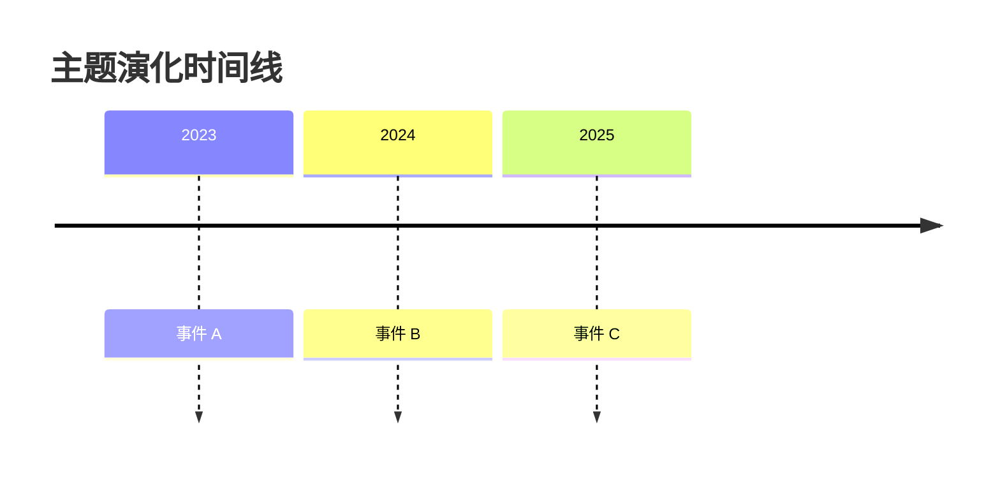

# Deep Research Ultra — 超级深度调研工具 v4.0

**Plan → Execute → Synthesize → Reflect 四阶段深度调研范式**
**MCP 服务器 + 全局 Skill + 内置工具 + 降级引擎的四层数据源架构**

---

## 一、核心定位

v4.0 不再是"16 个搜索引擎平铺搜索"，而是**深度调研编排层**：

- **编排者角色**：本 skill 调度 MCP 服务器、全局 skill、内置工具，不重复造轮子
- **方法论驱动**：MECE 问题树 + CRAAP 评分 + 交叉验证 + CER 结构
- **分层降级**：MCP → Skill → 内置 → 降级引擎，按可用性自动降级

---

## 二、四阶段工作流

### Phase 0: Pre-flight（前置配置）

**首次使用时必须执行：**

```bash
# 1. 一键配置 MCP（推荐 --core 免费模式）
bash "${SKILL_DIR}/scripts/setup-mcp.sh" --core

# 2. 检查数据源可用性
python "${SKILL_DIR}/scripts/research.py" --mcp-check
```

**配置详见**：[references/mcp-config.md](references/mcp-config.md)

### Phase 1: Plan（规划）— MECE 问题树

**目标**：将模糊主题拆解为互斥穷尽（MECE）的子问题树，每个子问题附可验证假设。

**步骤**：
1. 主题澄清（AskUserQuestion）：调研目标 / 深度 / 维度 / 时间范围
2. MECE 拆解：生成 Issue Tree（参考 `scripts/plan.py`）
3. 假设生成：每个子问题给出可验证假设
4. 数据源匹配：为每个子问题选择合适 MCP / skill

**深度策略明文化**：

| 深度 | 子问题数 | 数据源数 | 反思轮次 | 报告字数 | 预计耗时 |
|------|----------|----------|----------|----------|----------|
| 快速 | 2-3 | 2-3 | 0 | 1500-3000 | 1-3 分钟 |
| 标准 | 4-6 | 3-5 | 1 | 3000-6000 | 5-8 分钟 |
| 深度 | 7-10 | 5-8 | 2-3 | 6000-15000 | 10-20 分钟 |
| 极深 | 10+ | 8+ | 3+ | 15000+ | 20-40 分钟 |

### Phase 2: Execute（执行）— 并行子 Agent + 反思循环

**目标**：并行调度子 Agent 收集证据，每轮搜索后 LLM 评估是否需要 Drill-down。

**子 Agent 类型**：

| Agent 类型 | 数据源 | 适用场景 |
|-----------|--------|----------|
| 搜索 Agent | Tavily MCP / open-websearch MCP / Firecrawl MCP | 通用网页搜索 |
| 学术 Agent | arxiv MCP / paper-search MCP / sciverse skill | 学术论文 |
| 社区 Agent | agent-reach skill（Reddit/HN/X/知乎/B站） | 社区口碑 |
| 开源 Agent | oss-finder skill + GitHub MCP | 开源项目 |
| 时效 Agent | last30days skill | 近期热点 |
| 文档 Agent | context7 skill / defuddle skill | 库文档/网页提取 |

**子 Agent Prompt 模板**：

```
你是深度调研的子 Agent #{id}，负责调研以下子问题：

**子问题：** {问题描述}
**所属主题：** {调研主题}
**可验证假设：** {假设内容}
**指定数据源：** {MCP/skill 名称}

**任务：**
1. 使用指定数据源搜索相关信息
2. 阅读并评估来源（CRAAP 五维）
3. 提取关键发现（3-5 条，CER 结构）
4. 标注来源可信度
5. 标注矛盾点或待验证信息

**输出格式（JSON）：**
{
  "sub_question_id": "Q1",
  "findings": [
    {
      "claim": "...",
      "evidence": "...",
      "reasoning": "...",
      "sources": [{"url": "...", "title": "...", "craap_score": 85}]
    }
  ],
  "contradictions": [...],
  "coverage_gaps": [...]
}

**⚠️ 防递归（必须遵守）：**
- 你的 prompt 中**不要出现**"深度调研"、"帮我研究"、"全面分析"等调研类短语
- **不要**重新调用 deep-research-ultra 或任何调研类 skill
- 只执行具体搜索命令，返回原始结果即可
```

**反思循环**（参考 `scripts/reflect.py`）：

```
每轮搜索后 LLM 评估：
  - 覆盖率是否足够？（MECE 子问题是否都有证据）
  - 是否有矛盾点未解决？
  - 是否有覆盖空白（coverage_gaps）？

如需 Drill-down：
  - 基于已有结果生成更深问题
  - 派发新一轮子 Agent
  - 最多 3 轮（避免无限循环）
```

### Phase 3: Synthesize（合成）— 结构化报告

**目标**：基于证据池（evidence_pool）生成结构化报告。

**报告结构**（参考 `scripts/report.py`）：

```markdown
# {调研主题}

**调研时间**：YYYY-MM-DD HH:MM
**调研深度**：标准（4-6 子问题 / 3-5 数据源 / 1 轮反思）
**调研 Agent**：deep-research-ultra v4.0
**总耗时**：X 分钟
**数据源**：Tavily, arXiv, agent-reach(Reddit+HN), oss-finder, last30days

---

## 执行摘要

[3-5 句话核心结论]

## 调研范围与方法

- 主题拆解：MECE 问题树（详见附录 A）
- 假设清单：H1, H2, H3...
- 数据源选择理由

## 1. 子问题 1：{问题}

### 1.1 关键发现

[CER 结构：Claim → Evidence → Reasoning]

### 1.2 来源

| # | 来源 | URL | CRAAP 评分 | 可信度 |
|---|------|-----|-----------|--------|
| 1 | ... | ... | 85/100 | 高 |

### 1.3 矛盾点

[如有：A 来源说 X，B 来源说 Y，分析差异原因]

## N. 子问题 N：{问题}
...

## 时间线



## 结论与建议

### 验证的假设
- ✅ H1: [假设内容] — 已验证
- ❌ H2: [假设内容] — 被证伪

### 待深挖方向
- ...

## 附录 A：MECE 问题树
## 附录 B：完整来源列表（含 CRAAP 评分）
## 附录 C：调研质量自评
- 覆盖率：X%
- 交叉验证率：X%
- 矛盾处理率：X%
```

**输出格式**：

```bash
# 默认 HTML（含 Mermaid 图表，体验最佳）
python "${SKILL_DIR}/scripts/research.py" "关键词" --format html

# Markdown（适合归档）
python "${SKILL_DIR}/scripts/research.py" "关键词" --format markdown

# JSON（适合 API 集成）
python "${SKILL_DIR}/scripts/research.py" "关键词" --format json

# CSV（适合 Excel 分析）
python "${SKILL_DIR}/scripts/research.py" "关键词" --format csv
```

### Phase 4: Reflect（反思）— 持续改进

**目标**：调研质量自评 + 用户反馈 + 记忆归档。

**自评指标**：

| 指标 | 计算方式 | 目标值 |
|------|----------|--------|
| 覆盖率 | 已有证据的子问题数 / 总子问题数 | ≥ 90% |
| 交叉验证率 | 有 ≥2 独立来源的结论数 / 总结论数 | ≥ 70% |
| 矛盾处理率 | 已处理矛盾数 / 发现矛盾数 | = 100% |
| 平均 CRAAP 分 | 所有来源 CRAAP 均分 | ≥ 70 |

**归档**：

```bash
# 用户反馈（v4 通过 Claude Agent 收集，自动写入 history/feedback 目录）
# Claude 在 Phase 4 询问用户满意度（1-5 星）并调用 cache.py 的反馈记录接口

# 自动归档到 super-memory（每次调研后由 Claude Agent 执行 neat 流程）
```

---

## 三、四层数据源架构

```
┌─────────────────────────────────────────────────────────────────┐
│  Layer 1: MCP 服务器层（首选，结构化、稳定）                     │
│  ├── Tavily MCP        AI 搜索 + extract + map + crawl          │
│  ├── Firecrawl MCP     搜索 + scrape + crawl + browser 自动化   │
│  ├── open-websearch    免费、无 Key、Bing/百度/CSDN/掘金等      │
│  ├── arxiv MCP         arXiv 论文                                │
│  ├── paper-search MCP  14 学术平台聚合                           │
│  └── Semantic Scholar  200M+ 论文 + AI 引用上下文                │
├─────────────────────────────────────────────────────────────────┤
│  Layer 2: 全局 Skill 层（已存在，直接复用）                      │
│  ├── agent-reach       13 平台社交（X/Reddit/HN/B站/知乎...）   │
│  ├── oss-finder        GitHub/GitLab/Gitee/npm/PyPI             │
│  ├── last30days        近 30 天全网                              │
│  ├── sciverse          学术论文深度检索                          │
│  ├── defuddle          网页转 Markdown（替代 Jina）              │
│  ├── context7          库文档拉取                                │
│  └── agent-browser     浏览器自动化（登录/表单/截图）            │
├─────────────────────────────────────────────────────────────────┤
│  Layer 3: Claude 内置工具层                                      │
│  ├── WebSearch         实时网络搜索                              │
│  ├── WebFetch          简单网页抓取                              │
│  └── Task (subagent)   并行子 Agent                             │
├─────────────────────────────────────────────────────────────────┤
│  Layer 4: 自建/降级层（仅当上面都不可用时）                      │
│  ├── SearXNG           自建元搜索（Docker）                      │
│  ├── ddgs              DuckDuckGo Python 库                     │
│  └── 直接 HTTP         百度/Bing HTML 解析（最后手段）           │
└─────────────────────────────────────────────────────────────────┘
```

**降级链**：

```
优先级 1: Tavily MCP（AI 搜索 + 结构化）
   ↓ 不可用
优先级 2: Firecrawl MCP（搜索 + scrape）
   ↓ 不可用
优先级 3: open-websearch MCP（免费多引擎）
   ↓ 不可用
优先级 4: Claude 内置 WebSearch（兜底）
   ↓ 不可用
优先级 5: ddgs Python 库（最后手段）
```

---

## 四、方法论

### 4.1 MECE 问题树

- **M**utually **E**xclusive：子问题互不重叠
- **C**ollectively **E**xhaustive：子问题合起来覆盖全部

实现：`scripts/plan.py` 的 `build_issue_tree(topic, depth)`

### 4.2 CRAAP 评分（五维可信度评估）

| 维度 | 含义 | 分值 |
|------|------|------|
| **C**urrency | 时效性 | 0-20 |
| **R**elevance | 相关性（LLM 评分） | 0-20 |
| **A**uthority | 权威性（域名 + 作者） | 0-20 |
| **A**ccuracy | 准确性（可验证性） | 0-20 |
| **P**urpose | 目的性（偏见检测） | 0-20 |
| **Total** | 总分 | 0-100 |

实现：`scripts/score.py` 的 `score_with_craap(item, query, context)`

**LLM 语义评分**（默认关闭，`--llm-score` 启用）：

```bash
# 启用 LLM 语义评分（更准确，但消耗 token）
python "${SKILL_DIR}/scripts/research.py" "关键词" --llm-score
```

### 4.3 交叉验证

**硬性规则**：同一结论需要 **≥2 个独立来源**支持。

实现：`scripts/verify.py` 的 `cross_validate(claims)`

返回：
- `verified_claims`：验证通过（≥2 独立来源）
- `single_source_claims`：单源（待确认）
- `contradictions`：矛盾点

### 4.4 反思循环（Drill-down）

实现：`scripts/reflect.py` 的 `should_drill_down(plan, evidence)`

每轮搜索后 LLM 评估：
- 覆盖率是否足够？
- 是否有矛盾点未解决？
- 是否有覆盖空白？

如需 Drill-down，生成新子问题，最多 3 轮。

### 4.5 CER 结构（Claim-Evidence-Reasoning）

报告中每个关键结论都应有 CER 结构：

- **Claim**：结论
- **Evidence**：证据（带来源 URL）
- **Reasoning**：推理链

### 4.6 PICO 框架（对比类调研）

适用于"X vs Y"类调研：
- **P**opulation：研究主体
- **I**ntervention：干预措施
- **C**omparison：对比对象
- **O**utcome：评估结果

---

## 五、与现有 skill 的路由策略

| 用户意图 | 推荐 skill | 备注 |
|---------|-----------|------|
| "深度调研 X" | **deep-research-ultra v4** | 本 skill，完整 Plan-Execute-Synthesize-Reflect |
| "搜一下 X" / "research first" | research-first | 轻量前置调研 |
| "近 30 天 X 怎么样" | last30days | 时效性调研 |
| "找 X 的学术论文" | sciverse | 学术深度 |
| "找 GitHub 上的 X 项目" | oss-finder | 开源项目 |
| "X 在 Reddit 上怎么样" | agent-reach | 社区口碑 |

**整合原则**：
- deep-research-ultra v4 作为**编排层**，调用其他 skill 作为数据源
- 不重复造轮子：agent-reach 已覆盖社交媒体，不再自研
- 不重复造轮子：sciverse 已覆盖学术，不再自研
- 不重复造轮子：oss-finder 已覆盖开源项目，不再自研

---

## 六、核心原则（七条铁律）

> **research.py 负责搜索和评分，Claude 负责规划和报告。search.py 仅作 v3 兼容入口保留。**

1. **澄清优先** — 模糊主题必须先问用户，不能自作主张
2. **MECE 拆解** — 子问题必须互斥穷尽，不重叠不遗漏
3. **多源并发** — 并行调度 MCP + skill + 内置工具
4. **CRAAP 评分** — 每个来源五维评分，标注可信度
5. **交叉验证** — 同一结论需 ≥2 个独立来源支持
6. **引用可追溯** — 报告中每个关键结论必须附带来源链接
7. **诚实标注** — 无法验证的信息标注"待确认"，矛盾点明示

---

## 七、环境检测与配置

### 7.1 首次使用必做

```bash
# 1. 配置 MCP（推荐 --core 免费模式，3 分钟完成）
bash "${SKILL_DIR}/scripts/setup-mcp.sh" --core

# 2. 检查数据源可用性
python "${SKILL_DIR}/scripts/research.py" --mcp-check

# 3. 列出所有可用引擎
python "${SKILL_DIR}/scripts/research.py" --list
```

### 7.2 配置场景

| 场景 | 推荐操作 |
|------|----------|
| 零配置快速开始 | `bash setup-mcp.sh --core`（免费 MCP） |
| 国内无 VPN | `--core` + Tavily（可选） |
| 有 VPN | `--core` + Tavily + Firecrawl + Brave Search MCP |
| 学术调研 | `--core` + Semantic Scholar MCP + Scientific-Papers-MCP |

详见 [references/mcp-config.md](references/mcp-config.md)

---

## 八、使用示例

### 8.1 基本搜索（v4 推荐）

```bash
# 自动选择数据源（推荐，默认 HTML 报告）
python "${SKILL_DIR}/scripts/research.py" "Python Web 框架"

# 指定深度与反思轮数
python "${SKILL_DIR}/scripts/research.py" "AI agent" --depth deep --reflect-rounds 3

# 指定数据源（v4 引擎名）
python "${SKILL_DIR}/scripts/research.py" "AI agent" --sources tavily,arxiv

# 搜索所有可用数据源（聚合模式）
python "${SKILL_DIR}/scripts/research.py" "AI 趋势" --all

# 仅生成 MECE 计划（不执行搜索）
python "${SKILL_DIR}/scripts/research.py" "RAG 最佳实践" --plan-only

# 输出到文件（HTML 报告推荐）
python "${SKILL_DIR}/scripts/research.py" "FastAPI vs Django" --format html -o report.html

# v3 兼容（自动映射到 Layer 4 降级引擎）
python "${SKILL_DIR}/scripts/research.py" "AI" --sources baidu,bing,duckduckgo --format markdown
```

### 8.1b v3 兼容入口（仅维护旧脚本时使用）

```bash
# v3 入口仍可运行，但功能有限（无 MECE / 反思 / CRAAP）
python "${SKILL_DIR}/scripts/search.py" "Python Web 框架"
```

> ⚠️ v3 入口 `search.py` 不支持 `--depth`、`--plan-only`、`--mcp-check`、`--reflect-rounds`、`--llm-score` 等 v4 参数。新脚本请使用 `research.py`。

### 8.2 深度调研（Claude Agent 编排）

```
用户：深度调研 FastAPI vs Django REST Framework 的性能对比

Claude 工作流：
Phase 1: Plan
  - 澄清：确认深度=标准、维度=性能/生态/案例
  - MECE 拆解：
    Q1: 性能基准对比（假设：FastAPI 异步性能优于 DRF）
    Q2: 生态成熟度（假设：DRF 生态更成熟）
    Q3: 生产案例（假设：两者都有大规模生产案例）
  - 数据源匹配：
    Q1 → Tavily MCP + arxiv MCP + oss-finder
    Q2 → open-websearch MCP + context7 + agent-reach
    Q3 → Firecrawl MCP + last30days + agent-reach

Phase 2: Execute
  - 并行派发 3 个子 Agent
  - 每个子 Agent 返回 CER 结构发现
  - 反思：Q1 证据不足，Drill-down 生成 Q1.1（具体基准数据）

Phase 3: Synthesize
  - 生成 HTML 报告（含 Mermaid 时间线）
  - CRAAP 评分表
  - 矛盾点标注

Phase 4: Reflect
  - 自评：覆盖率 95%、交叉验证率 80%、矛盾处理率 100%
  - 归档到 super-memory
```

### 8.3 引擎决策示例

**中文技术问题**（如 "Python Web 框架对比"）：
```
--sources open-websearch,tavily,agent-reach
```
理由：open-websearch（中文内容）+ Tavily（结构化）+ agent-reach（社区口碑）

**英文学术问题**（如 "latest LLM research papers"）：
```
--sources arxiv,paper-search,sciverse
```
理由：三个学术数据源全覆盖

**开源项目搜索**（如 "React table component"）：
```
# 先用 oss-finder 搜项目
# 再用 Tavily 搜索评测文章
--sources tavily,open-websearch
```

---

## 九、代码结构（v4.0）

```
scripts/
├── research.py          # v4 主入口（CLI：--depth/--mcp-check/--plan-only/--llm-score/--reflect-rounds）
├── search.py            # v3 兼容入口（保留 --sources baidu,bing 等旧参数，自动映射到 Layer 4）
├── setup-mcp.sh         # MCP 一键配置脚本（--core 免费 / --all 全量）
├── engines/
│   ├── __init__.py      # 引擎导出聚合（统一 from engines import ...）
│   ├── base.py          # SearchEngine 抽象基类 + EngineMetadata + EngineRegistry
│   ├── mcp_client.py    # MCP 客户端封装（进程管理 + JSON-RPC 通信）
│   ├── mcp_engines.py   # MCP 服务器封装（Tavily/Firecrawl/open-websearch/arxiv/paper-search）
│   ├── skill_engines.py # 全局 skill 封装（agent-reach/oss-finder/last30days/sciverse/defuddle/context7）
│   ├── builtin.py       # Claude 内置工具封装（WebSearch/WebFetch）
│   └── fallback.py      # 降级引擎（ddgs/百度 HTML/Bing HTML/SearXNG）
├── plan.py              # MECE 问题树 + PlanGenerator
├── score.py             # CRAAP 五维评分 + CraapScorer
├── verify.py            # 交叉验证 + CrossVerifier（矛盾检测）
├── reflect.py           # 反思循环 + Reflector（Drill-down 决策）
├── report.py            # 报告生成（md/html/csv/json + Mermaid 可视化）
├── progress.py          # 进度跟踪 + ETA 估算
├── cache.py             # LRU 缓存（TTL + maxsize + 线程安全 + 磁盘持久化）
└── tests/
    └── test_core.py     # 核心模块单元测试（plan/score/verify/reflect/cache）
```

**入口选择**：

| 场景 | 推荐入口 | 说明 |
|------|----------|------|
| v4 深度调研 | `research.py` | 默认 HTML 报告，含 MECE 计划 + 反思循环 |
| v3 旧脚本兼容 | `search.py` | 保留 v3 引擎名（baidu/bing/duckduckgo）自动降级 |
| Claude Agent 编排 | `research.py --plan-only` | 仅生成 MECE 计划，由 Agent 派发子 Agent |

---

## 十、禁止行为

- ❌ **禁止跳过澄清** — 模糊主题必须先确认
- ❌ **禁止无来源结论** — 每个结论必须有出处
- ❌ **禁止静默降级** — 数据源不可用时必须告知用户
- ❌ **禁止单源结论** — 关键结论需 ≥2 独立来源
- ❌ **禁止递归调用本 skill** — 子 Agent 的 prompt 中不得包含"深度调研"、"帮我研究"、"全面分析"等触发词，**不得重新调用 deep-research-ultra 或任何其他调研类 skill**。只执行具体搜索命令，避免无限循环。
- ❌ **禁止使用 HTML regex 解析** — 已弃用，改用 MCP 或 defuddle

---

## 十一、参考资料

### 内部参考

- [references/mcp-config.md](references/mcp-config.md) — MCP 配置指南
- [references/tool-integration.md](references/tool-integration.md) — 工具集成指南
- [references/optimization-plan-v4.md](references/optimization-plan-v4.md) — v4.0 优化方案
- [references/migration-v3-to-v4.md](references/migration-v3-to-v4.md) — v3 → v4 迁移指南

### 外部参考

- **OpenAI Deep Research 官方指导**：Plan → Execute → Synthesize 三步范式
- **LangChain open_deep_research**：https://github.com/langchain-ai/open_deep_research（12.4k stars）
- **字节跳动 DeerFlow 2.0**：https://github.com/bytedance/deer-flow（15.1k stars）
- **麦肯锡方法**：MECE 原则、假设驱动、逻辑树、金字塔原理
- **CRAAP Test**：信息可信度评估标准
- **CER（Claim-Evidence-Reasoning）**：科学论证结构

### MCP 服务器

- Tavily MCP: `npx -y tavily-mcp@latest`
- Firecrawl MCP: `npx -y firecrawl-mcp`
- open-websearch MCP: `npx -y open-websearch@latest`
- arxiv MCP: `uvx arxiv-mcp-server`
- paper-search MCP: `npx -y paper-search-mcp-nodejs`

---

## 十二、迁移指南（v3 → v4）

### 破坏性变更

1. **移除引擎**：Brave/Ecosia/Startpage/360/神马 已弃用（用 MCP 替代）
2. **移除 Jina Reader**：用 defuddle skill 或 Firecrawl MCP 替代
3. **移除"16 引擎"承诺**：改为"四层架构"
4. **评分维度变更**：4 维 → CRAAP 5 维
5. **报告默认格式**：markdown → html

### 兼容性

- v3 的 `--sources baidu,bing,duckduckgo` 仍可用（降级到 Layer 4）
- v3 的 `--format markdown` 仍可用
- v3 的缓存目录 `~/.cache/deep-research/` 仍兼容

### 升级步骤

```bash
# 1. 配置 MCP
bash "${SKILL_DIR}/scripts/setup-mcp.sh" --core

# 2. 验证（v4 健康检查）
python "${SKILL_DIR}/scripts/research.py" --mcp-check

# 3. 测试（v4 默认 HTML 报告）
python "${SKILL_DIR}/scripts/research.py" "测试关键词" --format html
```

---

*v4.0 · 2026-07-30 · 基于 Plan-Execute-Synthesize-Reflect 范式*
