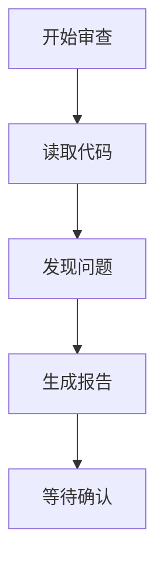

# 记忆压缩示例

## 场景：代码审查任务

### 初始状态
- 对话轮数：25 轮
- 上下文大小：12,000 tokens
- 工具调用：15 次

### 压缩过程

#### Step 1: 卸载旧对话
```
refs/history-20260528-1000.md (前 20 轮)
refs/history-20260528-1030.md (第 21-25 轮)
```

#### Step 2: 生成摘要
```json
{
  "type": "history_summary",
  "task": "代码审查",
  "summary": "审查了 Python 项目，发现 3 个问题：1) main 函数过长 2) 缺少错误处理 3) 命名不规范",
  "key_decisions": ["建议拆分 main 函数", "添加 try-except"],
  "current_state": "等待用户确认修改方案",
  "protected_recent": ["最近 3 轮对话"]
}
```

#### Step 3: 更新 Mermaid 画布


#### Step 4: 更新元数据
```json
{
  "task_id": "review-001",
  "task_name": "代码审查",
  "total_tokens": 12000,
  "saved_tokens": 6000,
  "strategies_used": ["摘要压缩", "上下文卸载"],
  "key_decisions": ["保留最近3轮", "生成结构化摘要"]
}
```

### 压缩结果
- 压缩前：12,000 tokens
- 压缩后：6,000 tokens
- 节省：50%
- 信息保留率：95%（关键信息完整）
