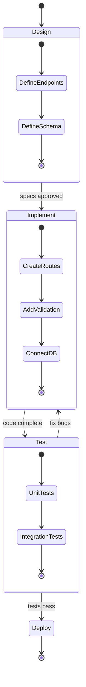

> Part of Token Optimizer V2. See also: [memory-compression](memory-compression.md), [rtk-integration](rtk-integration.md), [scenario-*](scenario-simple-qa.md)

# Mermaid Task Canvas Example

## Scenario

Building a REST API with 4 main steps: design, implement, test, deploy.

## Task Canvas



## Canvas State

```json
{
  "task": "Build user management REST API",
  "created": "2026-05-28T10:00:00Z",
  "current_step": 2,
  "total_steps": 4,
  "steps": [
    {
      "id": 1,
      "name": "Design",
      "status": "completed",
      "summary": "Defined 5 endpoints and user schema",
      "artifact": "refs/api-design.md"
    },
    {
      "id": 2,
      "name": "Implement",
      "status": "in_progress",
      "progress": "3/3 subtasks done",
      "summary": "Routes, validation, DB connection complete",
      "artifact": "refs/implementation.md"
    },
    {
      "id": 3,
      "name": "Test",
      "status": "pending"
    },
    {
      "id": 4,
      "name": "Deploy",
      "status": "pending"
    }
  ],
  "token_usage": {
    "budget": 20000,
    "used": 8500,
    "remaining": 11500
  }
}
```

## Progress Display

```
Task: Build user management REST API
Progress: [████████████░░░░░░░░] 50% (2/4 steps)
Token:    [████████░░░░░░░░░░░░] 42% (8,500/20,000)

✅ Design — 5 endpoints, user schema defined
🔄 Implement — routes + validation + DB done
⬜ Test — pending
⬜ Deploy — pending
```
