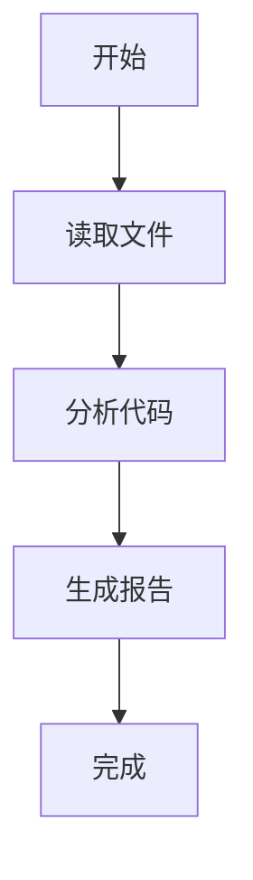
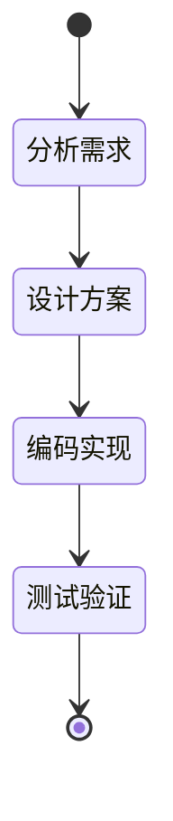
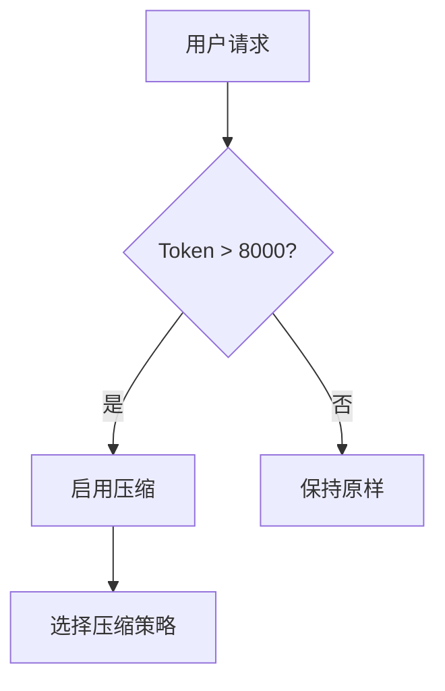

# Module: Memory Architect

> Part of Token Optimizer V2 Five-Layer Architecture
> Layer 2: Optimization Modules

## 四层记忆架构

### Level 0: Raw 原文
- 存储位置：refs/*.md
- 内容：完整的工具调用结果、对话原文
- 保留策略：始终保存，不删除

### Level 1: JSONL Summary
- 存储位置：refs/summary.jsonl
- 内容：工具调用级摘要
- 格式：
```json
{
  "timestamp": "2026-05-28T10:00:00",
  "tool": "read_file",
  "input": "path/to/file.py",
  "output_summary": "读取了 Python 文件，包含 3 个函数...",
  "key_facts": ["函数名: main, init, process"],
  "token_saved": 1500
}
```
- 触发条件：每次工具调用后

### Level 2: MMD Node
- 存储位置：canvas/task-state.mmd
- 内容：任务步骤级摘要（Mermaid 图）
- 格式：

- 触发条件：每完成一个步骤

### Level 3: Metadata
- 存储位置：refs/metadata.json
- 内容：任务级索引
- 格式：
```json
{
  "task_id": "task-001",
  "task_name": "代码审查",
  "start_time": "2026-05-28T10:00:00",
  "end_time": "2026-05-28T10:30:00",
  "total_tokens": 15000,
  "saved_tokens": 8000,
  "strategies_used": ["摘要压缩", "CLI压缩"],
  "key_decisions": ["使用 Sonnet 模型", "启用 RTK"]
}
```
- 触发条件：任务完成时

## 上下文卸载策略

### 何时卸载
- 对话超过 20 轮
- 上下文超过 8000 tokens
- 工具结果超过 500 tokens

### 如何卸载
1. 将旧对话保存到 refs/history-*.md
2. 生成摘要替代原文
3. 保留最近 3 轮对话原文

## Mermaid 画布使用

### 任务状态图


### 决策流程图


## 层次化注意力

### 鸟瞰（任务级）
- 查看 metadata.json
- 了解任务整体进度

### 聚焦（步骤级）
- 查看 canvas/task-state.mmd
- 了解当前步骤状态

### 下钻（工具级）
- 查看 refs/summary.jsonl
- 了解具体工具调用结果

## Fold/Expand 策略

### Fold（压缩）时机
- 步骤完成并验证后
- 工具结果 > 500 tokens
- 步骤完成超过 5 轮后

### Expand（展开）时机
- 用户引用历史步骤
- 需要验证早期输出
- 调试需要回溯

## Canvas State JSON

```json
{
  "task": "description",
  "current_step": 3,
  "total_steps": 5,
  "completed": [
    {"step": 1, "summary": "Analyzed requirements", "file": "refs/step-1-analysis.md"},
    {"step": 2, "summary": "Implemented feature X", "file": "refs/step-2-impl.md"}
  ],
  "active": {
    "step": 3,
    "description": "Running tests",
    "attempts": 1
  },
  "blockers": [],
  "token_budget": {
    "used": 12000,
    "remaining": 8000
  }
}
```

## 压缩效果

| 指标 | 优化前 | 优化后 | 节省 |
|------|--------|--------|------|
| WideSearch | 全量 | 压缩 | 61.38% |
| SWEbench | 全量 | 压缩 | 33.09% |
| 通过率(WideSearch) | 基准 | 提升 | +51.52% |
| 通过率(SWEbench) | 基准 | 提升 | +9.93% |
