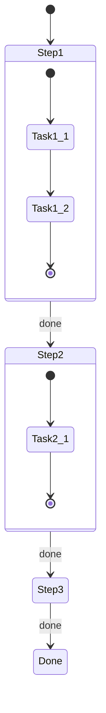

# Mermaid Task Canvas Template

Use this template for Module 4 task tracking.

## State Diagram Template



## Canvas State JSON Template

```json
{
  "task": "[task description]",
  "created": "[ISO timestamp]",
  "current_step": 1,
  "total_steps": 3,
  "steps": [
    {
      "id": 1,
      "name": "[step name]",
      "status": "in_progress",
      "started": "[ISO timestamp]",
      "token_estimate": 500,
      "subtasks": [
        {"name": "[subtask]", "done": true},
        {"name": "[subtask]", "done": false}
      ]
    },
    {
      "id": 2,
      "name": "[step name]",
      "status": "pending",
      "token_estimate": 300
    },
    {
      "id": 3,
      "name": "[step name]",
      "status": "pending",
      "token_estimate": 200
    }
  ],
  "artifacts": [],
  "blockers": [],
  "token_usage": {
    "budget": 20000,
    "used": 0,
    "remaining": 20000
  }
}
```

## Progress Bar Template

```
Task Progress: [████████░░░░░░░░░░░░] 40% (2/5 steps)
Token Budget:  [██████░░░░░░░░░░░░░░] 30% (6,000/20,000)
```
